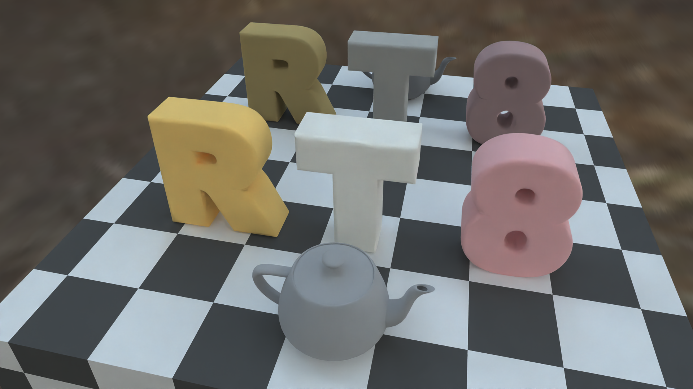

### 概要
[レイトレ合宿8](https://sites.google.com/view/raytracingcamp8) 用のレイトレーサーです。

[発表スライド](slide.pdf)

[レンダリング結果(動画)](result.mp4)

[Position-free Multiple-bounce Computations for Smith Microfacet BSDFs](https://wangningbei.github.io/2022/MBBRDF.html) を実装し、
エネルギー保存されたマイクロファセットモデルでの描画を行っています。

### 実行
実行すると Data/Output 内に連番のアニメーションでレンダリング結果が出力されます。

注意：動作に必要な IBL用 hdr ファイルはリポジトリに含んでいません。
実行時には、下記のページからダウンロードしてきた hdr ファイルを "probe.hdr" とリネームして "Data" フォルダ内に置いてください。 
http://www.pauldebevec.com/Probes/

### ライセンス
このリポジトリ自体のライセンスは MIT License としますが、
このリポジトリが依存しているリポジトリのライセンスは依存先それぞれが定義しているライセンスに準拠します。